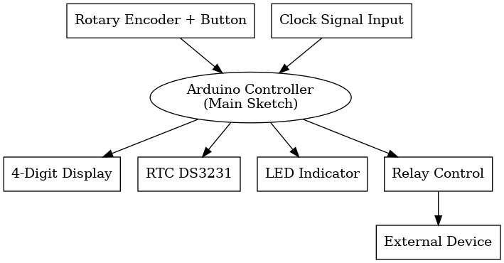

# ⏱️ Programmable Timer with RTC and 7-Segment Display (Arduino/C++)

This project implements a programmable, multi-stage timer using an RTC module, a 4-digit 7-segment display, and a rotary encoder.  
The system is designed to manage countdowns, control a relay output, and allow users to adjust programs and display brightness interactively.

---

## 📚 Features

- ⌛ **Multiple Timers**: Four programmable countdown stages.
- 🕰️ **RTC Integration**: Shows real-time clock (hours and minutes) when idle.
- 🔄 **Rotary Encoder Navigation**: Set and edit timers or adjust brightness dynamically.
- 🔥 **Relay Control**: Activates or deactivates external devices based on timer status.
- 💡 **Brightness Adjustment**: Manage the display brightness via the encoder.
- 📟 **Visual Feedback**: LED and 7-segment display animations for program feedback.

---

## 🛠️ Hardware Requirements

| Component | Purpose |
|:---|:---|
| Arduino Compatible Board | Main controller |
| DS3231 RTC Module | Real-Time Clock |
| 4-Digit 7-Segment Display + Shift Registers | Visual output |
| Rotary Encoder + Push Button | User interaction |
| Relay Module | External device control |
| LED | Program activity indicator |
| Resistors, Wires, Breadboard | Wiring |

---

## 📋 Pin Configuration

| Signal | Arduino Pin |
|:---|:---|
| Clock input (pulse counting) | 17 |
| Brightness control (PWM) | 7 |
| Shift Register - LATCH | 6 |
| Shift Register - CLOCK | 5 |
| Shift Register - DATA | 8 |
| Rotary Encoder CLK | 2 |
| Rotary Encoder DT | 3 |
| Rotary Encoder Button SW | 4 |
| Relay Output | 15 |
| LED Indicator | 16 |

---

## 🧠 Functional Overview

### 1. Startup
- Initializes the RTC module.
- Sets up the display and encoder.
- Reads initial encoder and button states.

### 2. Timer Program Modes
- 4 independent program slots (`program 0` to `program 3`).
- Each program has configurable minutes and seconds.
- Program `4` displays the live clock (HH:MM) from the RTC.

### 3. User Interaction (Button + Encoder)
- **Short Button Press (<500ms):**
  - Starts or resumes the countdown if a timer is active.
  - Switches digit position when configuring a timer.
- **Long Button Press (>500ms):**
  - Enters or exits timer setup mode.
- **Rotary Encoder Rotation:**
  - Adjusts current timer program, time digits, or brightness level.

### 4. Countdown Behavior
- Activates the relay output while counting down.
- When countdown reaches zero:
  - Relay deactivates.
  - Display flashes for feedback.
  - Automatically advances to the next program (circular).

### 5. Display and LED Behavior
- Shows active time remaining during countdown.
- Flashes digits during setup.
- LED blinking patterns vary by active program stage.

### 6. Brightness Control
- In RTC display mode (Program 4), pressing and rotating the encoder allows brightness adjustments.
- Brightness level saved dynamically to the display.

---

## 🔒 Security and Stability Notes

- All input readings (button, encoder) include debouncing logic.
- Critical operations (relay activation, program switching) are gated to prevent accidental changes.
- The RTC module automatically reinitializes if power is lost.

---

## 📂 Project Structure

```
/ShiftDisplay2.h   # Display library
/RTClib.h          # RTC library
/main.ino          # Main program sketch
/README.md         # Project documentation (this file)
```

---


## 🧩 System Architecture Overview

Below is a visual representation of the system's architecture, showing how each component interacts:



---

### 🔵 Diagram Key:

- **Rotary Encoder + Button**:  
  Allows user interaction to navigate between programs, set timers, and adjust brightness.

- **Clock Signal Input**:  
  Optional input for external clock pulse counting (e.g., event synchronization).

- **Arduino Controller**:  
  Main processing unit running the custom sketch.

- **4-Digit Display**:  
  Displays countdowns, real-time clock (RTC), and timer programming interface.

- **RTC DS3231**:  
  Provides accurate real-time clock data even in the absence of external power.

- **LED Indicator**:  
  Blinks to represent different timer program statuses.

- **Relay Control**:  
  Activates an external device (e.g., motor, lamp, or actuator) based on the countdown logic.

- **External Device**:  
  Whatever device you wish to control through the relay output.

---

This architecture ensures the system remains **modular**, **scalable**, and **secure**, capable of managing both time-based automation and user-driven interactions efficiently.


---

## 📜 License

This project is open-source and available under the MIT License.

---

> _"Always learning. Always adapting."_ 🚀